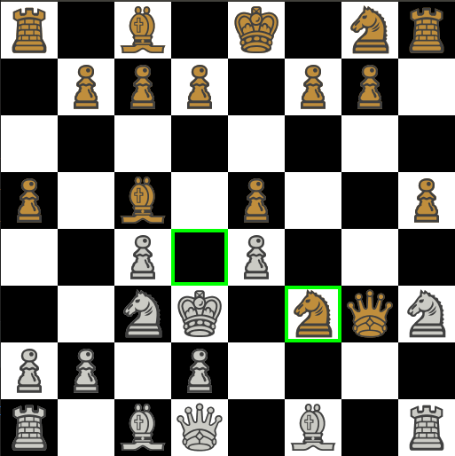

# Chess

The chess game with an AI.

The AI is implemented using the minimax algorithm with alpha-beta pruning.

It requires the [pygame](https://www.pygame.org/) library to run.

Usage: `python3 main.py $WHITE_PLAYER_TYPE $BLACK_PLAYER_TYPE`

The `$PLAYER_TYPE` must be either `HUMAN` or `AI`.

If no arguments are passed, you'll play as white and the AI will play as black.
